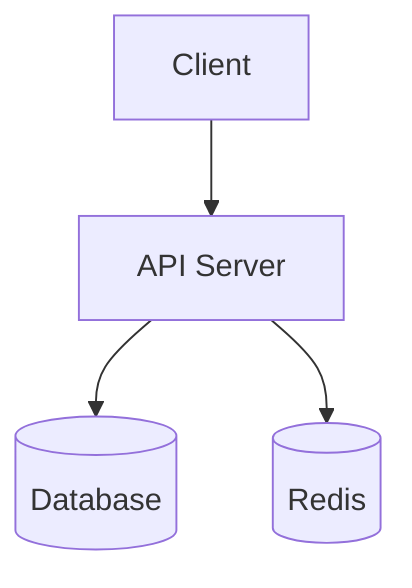

# Code Report for Product Managers — VitePress Docs Generator

Generate a ready-to-build VitePress documentation site from one or more codebases.
The reader is a **product manager** — someone who needs to understand what the code does,
what it exposes to users, what it depends on, and where there are opportunities to
improve, **without reading the code themselves.**

The output is a VitePress project: Markdown files with frontmatter, a config file,
and a `package.json`. The user runs `npm install && npm run docs:dev` to view locally
or `npm run docs:build` to get a static site they can host anywhere.

---

## Step 0 — Determine scan scope (single repo vs multi-repo)

The user specifies a folder path. Determine whether it contains one project or many.

### Detection logic

1. List the contents of the specified folder.
2. Check if the folder itself is a repo:
   - Contains `.git/` OR a root manifest (`package.json`, `pyproject.toml`, `Cargo.toml`,
     `go.mod`, `pom.xml`, `build.gradle`, `Gemfile`, `composer.json`)
   - If yes → **single-repo mode**.

3. If not a repo itself, check immediate children:
   - 2+ children look like repos → **multi-repo mode**.
   - 1 child looks like a repo → single-repo (that child).
   - 0 children → check one level deeper for monorepo patterns (`packages/`, `apps/`,
     `services/`, `workspaces`). If still nothing, ask the user for guidance.

4. For monorepos (single repo with workspaces):
   - Treat root as the umbrella project.
   - Treat each workspace/package as a sub-project.
   - Generate both per-project pages AND a root overview.

State what you detected before proceeding:
> "I detected **3 repositories** in this folder: `web-app/` (Frontend), `api-server/`
> (Backend), `gateway/` (BFF). I'll generate a VitePress docs site covering all three."

---

## Step 1 — Classify each project

For each detected project, identify its type using these signals:

| Signal file / directory              | Suggests                                |
|--------------------------------------|-----------------------------------------|
| `package.json` with `react`, `next`, `vue`, `angular`, `svelte` | Frontend / fullstack |
| `pages/`, `app/`, `src/routes/`      | Frontend with file-based routing        |
| `server/`, `api/`, `controllers/`, `routes/` | Backend API                     |
| `Dockerfile`, `docker-compose.yml`   | Containerized service                   |
| `requirements.txt`, `pyproject.toml`, `Cargo.toml`, `go.mod` | Backend        |
| `prisma/`, `migrations/`, `models/`  | Backend with ORM / database             |
| `graphql/`, `schema.graphql`         | GraphQL API (possibly BFF)              |
| Thin layer calling other APIs        | BFF pattern                             |
| `openapi.yaml`, `swagger.json`       | REST API with contract                  |
| `terraform/`, `infra/`, `cdk/`       | Infrastructure-as-code                  |
| `lib/`, `sdk/`, `packages/`          | Shared library / monorepo               |

Read the manifest file (`package.json`, etc.) for name, description, dependencies, scripts.
Read `README.md` if present.

Classify into: **Frontend**, **Backend**, **BFF**, **Fullstack**, **Library / SDK**,
**Infrastructure**, or **Other**.

---

## Step 2 — Deep scan each project

Read the reference checklist for each project's type:

| Repo type      | Reference to read                    |
|----------------|--------------------------------------|
| Frontend       | `references/frontend-checklist.md`   |
| Backend        | `references/backend-checklist.md`    |
| BFF            | `references/bff-checklist.md`        |
| Fullstack      | Read both frontend AND backend       |
| Library / SDK  | `references/backend-checklist.md` (adapt) |
| Infrastructure | `references/backend-checklist.md` (adapt) |
| Other          | Best judgment; pull from all          |

Walk through each checklist. For every item, search actual source files — do not guess.
Use `grep`, `find`, and file reads.

### Collect diagram data during scan

As you scan, note data for these Mermaid diagrams:

1. **Architecture diagram** (per project) — components and data flow
2. **ER diagram** (backend/BFF) — entities and relationships
3. **Sequence diagram** — typical request flow through the system
4. **Dependency graph** (multi-repo) — how projects connect
5. **API contract map** (multi-repo) — who produces/consumes each API

---

## Step 3 — Generate the VitePress project

Read `references/site-structure.md` for the page-by-page content specification.
Read `templates/vitepress-scaffold.md` for the exact file structure, config, and
package.json to generate.

### Output file structure

**Single-repo mode:**
```
[project-name]-docs/
├── package.json
├── docs/
│   ├── .vitepress/
│   │   └── config.mts
│   ├── index.md                    ← Executive Summary (home page)
│   ├── architecture.md
│   ├── routes.md
│   ├── inputs.md
│   ├── analytics.md
│   ├── dependencies.md
│   ├── data-model.md
│   ├── auth.md
│   ├── configuration.md
│   ├── risks.md
│   ├── improvements.md
│   └── glossary.md
```

**Multi-repo mode:**
```
docs-wiki/
├── package.json
├── docs/
│   ├── .vitepress/
│   │   └── config.mts
│   ├── index.md                    ← System Overview (home page)
│   ├── cross-repo-deps.md
│   ├── api-contracts.md
│   ├── shared-deps.md
│   ├── risks.md                    ← Consolidated risk register
│   ├── glossary.md                 ← Consolidated glossary
│   ├── [project-a]/
│   │   ├── index.md                ← Project A summary
│   │   ├── architecture.md
│   │   ├── routes.md
│   │   ├── inputs.md
│   │   ├── analytics.md
│   │   ├── dependencies.md
│   │   ├── data-model.md
│   │   ├── auth.md
│   │   ├── configuration.md
│   │   ├── risks.md
│   │   └── improvements.md
│   ├── [project-b]/
│   │   └── ... (same structure)
│   └── ...
```

### Writing guidelines (apply to all pages)

- **Lead with "so what"** — connect every technical fact to a product implication.
- Use Markdown tables for structured data; prose for narrative context.
- Use VitePress custom containers for callouts:
  ```md
  ::: tip 💡 Insight
  This endpoint handles 80% of traffic but has no rate limiting.
  :::

  ::: warning ⚠️ Risk
  The auth token never expires — a stolen token works forever.
  :::

  ::: danger 🚨 Critical
  User passwords are stored in plain text in the database.
  :::
  ```
- Keep the executive summary genuinely executive — no jargon, no filler.
- Phrase improvements as hypotheses: "Consider..." not "You must..."
- In the glossary, don't just expand acronyms — explain what they mean for the product.

### Mermaid diagram guidelines

Use fenced code blocks with `mermaid` language tag (VitePress plugin renders them):

````md

````

Diagram types:
- `graph TD` / `graph LR` — architecture, dependency graphs
- `erDiagram` — data model / entity relationships
- `sequenceDiagram` — request flows, auth flows
- `flowchart LR` — decision trees, routing logic, CI/CD
- `pie` — dependency breakdown

Keep diagrams readable: max ~15 nodes, short labels, color-code by layer/project.

---

## Step 4 — Build and output

Read `templates/vitepress-scaffold.md` for the exact `package.json`, `config.mts`,
and file content to generate.

Steps:
1. Create the output directory under `/mnt/user-data/outputs/`
2. Write `package.json` with VitePress + mermaid plugin dependencies
3. Write `docs/.vitepress/config.mts` with sidebar config matching all generated pages
4. Write each Markdown page with frontmatter and content
5. Present the output folder to the user

Tell the user:
> "Your docs site is ready. To view it locally:
> ```
> cd [folder-name]
> npm install
> npm run docs:dev
> ```
> To build a static site for hosting: `npm run docs:build`
> The output will be in `docs/.vitepress/dist/`."
