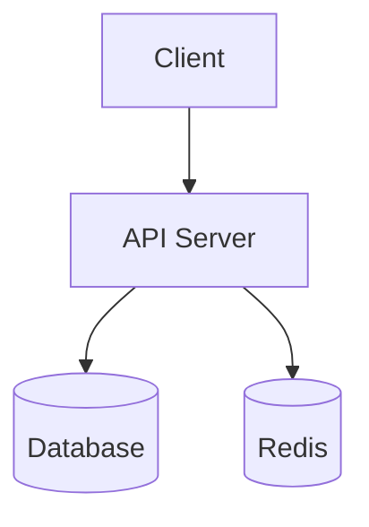

# Code Report for Product Managers — VitePress Docs Generator

Generate a ready-to-build VitePress documentation site from one or more codebases.
The reader is a **product manager** — someone who needs to understand what the code does,
what it exposes to users, what it depends on, and where there are opportunities to
improve, **without reading the code themselves.**

The output is a VitePress project: Markdown files with frontmatter, a config file,
and a `package.json`. The user runs `npm install && npm run docs:dev` to view locally
or `npm run docs:build` to get a static site they can host anywhere.

## Load Only The Companion Files You Need

This skill keeps its companion references at the repo root:

- `frontend-checklist.md`
- `backend-checklist.md`
- `bff-checklist.md`
- `site-structure.md`
- `vitepress-scaffold.md`

Load only the files relevant to the detected project types. Do not read every companion
file unless the repo mix requires it.

---

## Step 0 — Determine scan scope (single repo vs multi-repo)

The user specifies a folder path. Determine whether it contains one project or many.

### Detection logic

1. List the contents of the specified folder.
2. Check if the folder itself is a repo:
   - Contains `.git/` OR a root manifest (`package.json`, `pyproject.toml`, `Cargo.toml`,
     `go.mod`, `pom.xml`, `build.gradle`, `Gemfile`, `composer.json`)
   - If yes → **single-repo mode**.

3. If not a repo itself, check immediate children:
   - 2+ children look like repos → **multi-repo mode**.
   - 1 child looks like a repo → single-repo (that child).
   - 0 children → check one level deeper for monorepo patterns (`packages/`, `apps/`,
     `services/`, `workspaces`). If still nothing, ask the user for guidance.

4. For monorepos (single repo with workspaces):
   - Treat root as the umbrella project.
   - Treat each workspace/package as a sub-project.
   - Generate both per-project pages AND a root overview.

State what you detected before proceeding:
> "I detected **3 repositories** in this folder: `web-app/` (Frontend), `api-server/`
> (Backend), `gateway/` (BFF). I'll generate a VitePress docs site covering all three."

---

## Step 1 — Classify each project

For each detected project, identify its type using these signals:

| Signal file / directory              | Suggests                                |
|--------------------------------------|-----------------------------------------|
| `package.json` with `react`, `next`, `vue`, `angular`, `svelte` | Frontend / fullstack |
| `pages/`, `app/`, `src/routes/`      | Frontend with file-based routing        |
| `server/`, `api/`, `controllers/`, `routes/` | Backend API                     |
| `Dockerfile`, `docker-compose.yml`   | Containerized service                   |
| `requirements.txt`, `pyproject.toml`, `Cargo.toml`, `go.mod` | Backend        |
| `prisma/`, `migrations/`, `models/`  | Backend with ORM / database             |
| `graphql/`, `schema.graphql`         | GraphQL API (possibly BFF)              |
| Thin layer calling other APIs        | BFF pattern                             |
| `openapi.yaml`, `swagger.json`       | REST API with contract                  |
| `terraform/`, `infra/`, `cdk/`       | Infrastructure-as-code                  |
| `lib/`, `sdk/`, `packages/`          | Shared library / monorepo               |

Read the manifest file (`package.json`, etc.) for name, description, dependencies, scripts.
Read `README.md` if present.

Classify into: **Frontend**, **Backend**, **BFF**, **Fullstack**, **Library / SDK**,
**Infrastructure**, or **Other**.

---

## Step 1.5 — Check for existing documentation

Before scanning, check if documentation has already been generated for this codebase
at the current commit.

```bash
# Get the current HEAD commit hash for each project
git -C [repo-path] rev-parse HEAD 2>/dev/null
```

Look for an existing docs output folder (e.g., `[project-name]-docs/` or `docs-wiki/`).
If found, check for a `.codelens-meta.json` file inside it:

```json
{
  "generated_at": "2026-03-15T10:30:00Z",
  "commit_hash": "abc123def456...",
  "repo_path": "/path/to/repo",
  "projects_scanned": ["web-app", "api-server"]
}
```

**If the commit hash matches the current HEAD:**
> "Documentation already exists for this commit (`{{short_hash}}`).
> The code has not changed since the last generation on {{date}}.
> Would you like to regenerate anyway, or view the existing docs?"

Skip regeneration unless the user explicitly asks to regenerate.

**If no `.codelens-meta.json` exists or the commit differs**, proceed with scanning.

At the end of generation (Step 4), write this metadata file so future runs can detect
unchanged code.

---

## Step 2 — Deep scan each project

Read the reference checklist for each project's type:

| Repo type      | Reference to read                    |
|----------------|--------------------------------------|
| Frontend       | `frontend-checklist.md`              |
| Backend        | `backend-checklist.md`               |
| BFF            | `bff-checklist.md`                   |
| Fullstack      | Read both frontend AND backend       |
| Library / SDK  | `backend-checklist.md` (adapt)       |
| Infrastructure | `backend-checklist.md` (adapt)       |
| Other          | Best judgment; pull from all          |

Walk through each checklist. For every item, search actual source files — do not guess.
Prefer `rg` and `rg --files` for fast, repo-wide scans. Use direct file reads to confirm
the exact behavior behind each match before documenting it.

### Track analytics events discovered during scan

As you scan each project, maintain a running inventory of every analytics event found.
Record each event in this format:

| Event Name | Trigger | Payload Fields | Provider | Source File | Line |
|------------|---------|----------------|----------|-------------|------|
| `page_view` | Route change | `{ path, referrer }` | Google Analytics | `src/analytics.ts` | 42 |
| `signup_completed` | Form submit | `{ method, plan }` | Mixpanel | `src/auth/SignupForm.tsx` | 118 |

This inventory feeds directly into the `analytics.md` page. Having the source file
and line number lets PMs trace each event back to the code if they need engineering
context.

Also track **analytics gaps** — product questions that existing events cannot answer.
Use the AARRR framework (Acquisition, Activation, Revenue, Retention, Referral) as
described in each checklist.

### Collect diagram data during scan

As you scan, note data for these Mermaid diagrams:

1. **Architecture diagram** (per project) — components and data flow
2. **ER diagram** (backend/BFF) — entities and relationships
3. **Sequence diagram** — typical request flow through the system
4. **Dependency graph** (multi-repo) — how projects connect
5. **API contract map** (multi-repo) — who produces/consumes each API

---

## Step 3 — Generate the VitePress project

Read `site-structure.md` for the page-by-page content specification.
Read `vitepress-scaffold.md` for the exact file structure, config, and
package.json to generate.

### Output file structure

**Single-repo mode:**
```
[project-name]-docs/
├── package.json
├── docs/
│   ├── .vitepress/
│   │   └── config.mts
│   ├── index.md                    ← Executive Summary (home page)
│   ├── architecture.md
│   ├── routes.md
│   ├── inputs.md
│   ├── analytics.md
│   ├── dependencies.md
│   ├── data-model.md
│   ├── auth.md
│   ├── configuration.md
│   ├── risks.md
│   ├── improvements.md
│   └── glossary.md
```

**Multi-repo mode:**
```
docs-wiki/
├── package.json
├── docs/
│   ├── .vitepress/
│   │   └── config.mts
│   ├── index.md                    ← System Overview (home page)
│   ├── cross-repo-deps.md
│   ├── api-contracts.md
│   ├── shared-deps.md
│   ├── risks.md                    ← Consolidated risk register
│   ├── glossary.md                 ← Consolidated glossary
│   ├── [project-a]/
│   │   ├── index.md                ← Project A summary
│   │   ├── architecture.md
│   │   ├── routes.md
│   │   ├── inputs.md
│   │   ├── analytics.md
│   │   ├── dependencies.md
│   │   ├── data-model.md
│   │   ├── auth.md
│   │   ├── configuration.md
│   │   ├── risks.md
│   │   └── improvements.md
│   ├── [project-b]/
│   │   └── ... (same structure)
│   └── ...
```

### Writing guidelines (apply to all pages)

- **Lead with "so what"** — connect every technical fact to a product implication.
- Use Markdown tables for structured data; prose for narrative context.
- Use VitePress custom containers for callouts:
  ```md
  ::: tip 💡 Insight
  This endpoint handles 80% of traffic but has no rate limiting.
  :::

  ::: warning ⚠️ Risk
  The auth token never expires — a stolen token works forever.
  :::

  ::: danger 🚨 Critical
  User passwords are stored in plain text in the database.
  :::
  ```
- Keep the executive summary genuinely executive — no jargon, no filler.
- Phrase improvements as hypotheses: "Consider..." not "You must..."
- In the glossary, don't just expand acronyms — explain what they mean for the product.

### Mermaid diagram guidelines

Use fenced code blocks with `mermaid` language tag (VitePress plugin renders them):

````md

````

Diagram types:
- `graph TD` / `graph LR` — architecture, dependency graphs
- `erDiagram` — data model / entity relationships
- `sequenceDiagram` — request flows, auth flows
- `flowchart LR` — decision trees, routing logic, CI/CD
- `pie` — dependency breakdown

Keep diagrams readable: max ~15 nodes, short labels, color-code by layer/project.

### Fullscreen diagrams

Add a fullscreen toggle to every Mermaid diagram so users can expand complex diagrams.
Include a custom CSS file and a small script in the VitePress theme:

Create `docs/.vitepress/theme/index.ts`:

```typescript
import DefaultTheme from 'vitepress/theme'
import './custom.css'

export default {
  extends: DefaultTheme,
  enhanceApp({ app, router, siteData }) {
    if (typeof window !== 'undefined') {
      // Add fullscreen toggle to all Mermaid diagrams after page load
      router.onAfterRouteChanged = () => {
        setTimeout(() => {
          document.querySelectorAll('.mermaid').forEach((el) => {
            if (el.querySelector('.fullscreen-btn')) return
            const btn = document.createElement('button')
            btn.className = 'fullscreen-btn'
            btn.textContent = '⛶ Fullscreen'
            btn.title = 'View diagram fullscreen'
            btn.addEventListener('click', () => {
              el.classList.toggle('mermaid-fullscreen')
              btn.textContent = el.classList.contains('mermaid-fullscreen')
                ? '✕ Exit Fullscreen'
                : '⛶ Fullscreen'
            })
            el.style.position = 'relative'
            el.appendChild(btn)
          })
        }, 500)
      }
    }
  }
}
```

Create `docs/.vitepress/theme/custom.css`:

```css
.mermaid {
  position: relative;
}

.fullscreen-btn {
  position: absolute;
  top: 8px;
  right: 8px;
  z-index: 10;
  padding: 4px 12px;
  font-size: 12px;
  cursor: pointer;
  background: var(--vp-c-bg-soft);
  border: 1px solid var(--vp-c-border);
  border-radius: 4px;
  color: var(--vp-c-text-2);
  opacity: 0;
  transition: opacity 0.2s;
}

.mermaid:hover .fullscreen-btn {
  opacity: 1;
}

.mermaid-fullscreen {
  position: fixed !important;
  top: 0;
  left: 0;
  width: 100vw !important;
  height: 100vh !important;
  z-index: 9999;
  background: var(--vp-c-bg);
  display: flex;
  align-items: center;
  justify-content: center;
  padding: 2rem;
  overflow: auto;
}

.mermaid-fullscreen .fullscreen-btn {
  position: fixed;
  top: 16px;
  right: 16px;
  opacity: 1;
  z-index: 10000;
}

.mermaid-fullscreen svg {
  max-width: 95vw;
  max-height: 90vh;
}
```

These two files must be generated alongside the VitePress scaffold. Add them to the
output file structure in Step 4.

### Code references in generated documentation

For every feature, route, analytics event, dependency, or risk documented in the
generated pages, include a **source code reference** pointing back to the original
file and line number. Use this format in tables:

```markdown
| Feature | Description | Source |
|---------|-------------|--------|
| Login form | Email + password with validation | [`src/auth/Login.tsx:24`](../path) |
```

For significant findings, include inline code snippets showing the relevant code:

````markdown
::: details 📄 Source: `src/middleware/auth.ts:15-28`
```typescript
export function validateToken(req: Request, res: Response, next: NextFunction) {
  const token = req.headers.authorization?.split(' ')[1]
  if (!token) return res.status(401).json({ error: 'No token provided' })
  // Token never expires — see Risk Register
  jwt.verify(token, process.env.JWT_SECRET!, (err, decoded) => {
    if (err) return res.status(403).json({ error: 'Invalid token' })
    req.user = decoded
    next()
  })
}
```
:::
````

Guidelines for code references:
- **Always include** file path and line number for: route definitions, analytics events,
  auth logic, error handlers, and risk-related code.
- **Include code snippets** (using VitePress `details` containers) for: security-relevant
  code, complex business logic, and risk findings that benefit from seeing the actual code.
- **Skip code snippets** for trivial items like dependency versions or config variable names
  where the table entry is self-explanatory.

---

## Step 4 — Build and output

Read `vitepress-scaffold.md` for the exact `package.json`, `config.mts`,
and file content to generate.

Steps:
1. If the user gave an output path, use it. Otherwise create the docs site in the current
   workspace or next to the scanned repo using a clear folder name such as
   `[project-name]-docs/` or `docs-wiki/`.
2. Write `package.json` with VitePress + mermaid plugin dependencies
3. Write `docs/.vitepress/config.mts` with sidebar config matching all generated pages
4. Write `docs/.vitepress/theme/index.ts` and `docs/.vitepress/theme/custom.css` for
   fullscreen diagram support (see Mermaid diagram guidelines above)
5. Write each Markdown page with frontmatter and content, including code references
   and source snippets as described in "Code references in generated documentation"
6. Write `.codelens-meta.json` at the docs root with the current commit hash, timestamp,
   and list of scanned projects (for same-commit detection on future runs)
7. Verify the generated file set matches the sidebar config and that intentionally skipped
   topics still have placeholder pages

### Step 4.5 — Verify documentation by random sampling

After generating all pages, verify accuracy by randomly sampling entries:

1. **Pick 3–5 documented routes/endpoints at random** from `routes.md`. For each, open the
   source file referenced and confirm the route exists, the method is correct, and the
   auth requirement matches what was documented.

2. **Pick 2–3 analytics events at random** from `analytics.md`. Verify the event name,
   trigger, and payload match the actual code at the referenced file and line.

3. **Pick 2–3 dependencies at random** from `dependencies.md`. Confirm the version and
   category are correct by checking the manifest file (`package.json`, `requirements.txt`,
   etc.).

4. **Pick 1–2 risk findings at random** from `risks.md`. Re-read the source code referenced
   and confirm the risk is accurately described.

5. **Verify 1–2 Mermaid diagrams** by checking that nodes and edges match the actual
   component/service relationships found during scanning.

If any sampled item is inaccurate, fix it immediately and re-check related entries
(e.g., if a route was wrong, re-verify all routes from the same file).

Report verification results to the user:
> "Verification: sampled {{N}} items across routes, analytics, dependencies, and risks.
> {{All accurate / N corrections made}}."

---

## Step 5 — Run instructions

At the end of output, always provide these instructions for the user:

> ### How to Run the Generated Documentation
>
> **Prerequisites:**
> - Node.js (v18 or later) and npm installed
> - See `REQUIREMENTS.md` for full setup instructions
>
> **Local development (live preview with hot reload):**
> ```bash
> cd [folder-name]
> npm install
> npm run docs:dev
> ```
> Open the URL shown in the terminal (usually `http://localhost:5173`).
>
> **Build a static site for hosting:**
> ```bash
> cd [folder-name]
> npm run docs:build
> ```
> The output will be in `docs/.vitepress/dist/`. Deploy this folder to any static
> hosting service (Vercel, Netlify, GitHub Pages, S3, etc.).
>
> **Preview the production build locally:**
> ```bash
> npm run docs:preview
> ```
>
> **Fullscreen diagrams:**
> Hover over any Mermaid diagram and click the "⛶ Fullscreen" button to expand it.
> Press "✕ Exit Fullscreen" or hit Escape to return to normal view.
