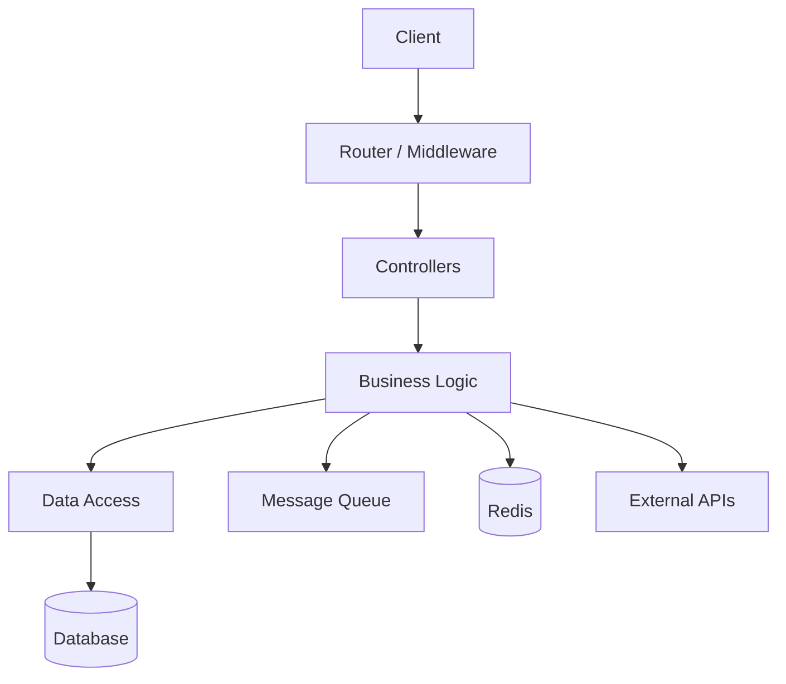
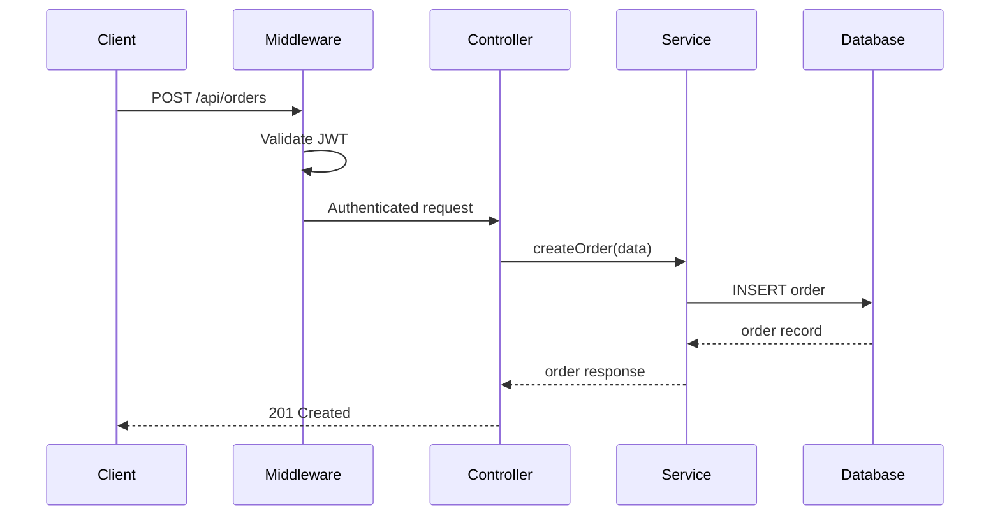

# Backend Checklist

When the repo is classified as a **backend** service, extract the following by reading
actual source files.

Prefer `rg`/`rg --files` over `grep` and target the real service roots in the repo
instead of assuming a single `src/` directory.

---

## Routes & API Endpoints

Identify every API endpoint using framework-specific patterns:

- **Express.js:** `app.get(`, `app.post(`, `router.get(`, `router.post(`, etc.
- **Fastify:** `fastify.get(`, `fastify.route(`.
- **NestJS:** `@Get(`, `@Post(`, `@Controller(` decorators.
- **Django:** `urlpatterns`, `path(`, DRF `@action`.
- **Flask:** `@app.route(`, `@blueprint.route(`.
- **FastAPI:** `@app.get(`, `@router.post(`.
- **Rails:** `config/routes.rb`.
- **Go:** `HandleFunc`, `r.GET`, `e.POST`.
- **Rust:** `#[get(`, `.route(`.
- **GraphQL:** schema queries and mutations.
- **OpenAPI/Swagger:** parse `openapi.yaml` or `swagger.json` if present.

For each: method, path, purpose, request params, response shape, auth required, rate
limited, and the **source file and line number** that defines it.

Include code references in the generated routes table:

```markdown
| Method | Path | Purpose | Auth | Source |
|--------|------|---------|------|--------|
| POST | `/api/orders` | Create order | JWT | [`src/routes/orders.ts:45`] |
| GET | `/api/users/:id` | Get user profile | JWT | [`src/routes/users.ts:12`] |
```

For endpoints with complex middleware chains or business logic, add a code snippet:

````markdown
::: details 📄 Source: `src/routes/orders.ts:45-67`
```typescript
router.post('/api/orders', authenticate, validateBody(orderSchema), async (req, res) => {
  const order = await orderService.create(req.body, req.user.id)
  await notificationService.sendOrderConfirmation(order)
  res.status(201).json(order)
})
```
:::
````

## Architecture

Determine the pattern: monolith, microservices, serverless, modular monolith.

Look for: directory structure (`controllers/`, `services/`, `repositories/`), layered
architecture, event-driven patterns, CQRS, background job processing.

### Diagram: Architecture layers



### Diagram: Request flow



## Databases & Data Model

```bash
rg --files . -g '*.prisma' -g '*.sql' -g '*/migrations/*' -g '*/models/*' | head -30
rg -n 'DATABASE_URL|MONGO_URI|REDIS_URL|postgres|mysql|sqlite|mongodb|dynamodb' .
```

For each data store: type, what data it holds, key tables, relationships, migration tool.

### Diagram: ER diagram

```mermaid
erDiagram
    USER ||--o{ ORDER : places
    USER { uuid id PK; string email; string name; string role }
    ORDER ||--|{ ORDER_ITEM : contains
    ORDER { uuid id PK; uuid user_id FK; decimal total; string status }
```

## Dependencies & External Services

Categorize: web framework, DB/ORM, auth, message queue, external APIs, caching,
file storage, monitoring, testing.

Flag external services — each is a failure point the PM should know about.

Also note background workers, queues, schedulers, and cron-style jobs because they are
often product-critical even when no user hits them directly.

## Analytics & Tracking Events

Backend services often emit server-side analytics events for actions that don't
originate from a UI click (e.g., webhook processing, cron jobs, queue consumers).

```bash
rg -n 'track\(|analytics\.|logEvent|emit\(|publish\(|sendEvent|metrics\.' .
rg -n 'statsd|prometheus|datadog|newrelic|cloudwatch' .
rg -n 'audit_log|audit\.log|AuditLog' .
```

For each event: name, trigger, payload fields, destination (analytics provider, log,
queue), **source file, and line number**.

| Event Name | Trigger | Payload | Destination | Source File | Line |
|------------|---------|---------|-------------|-------------|------|
| `order.created` | POST /api/orders | `{ order_id, user_id, total }` | Event bus | `src/services/order.ts` | 88 |
| `payment.failed` | Stripe webhook | `{ payment_id, error }` | Datadog | `src/webhooks/stripe.ts` | 34 |

## Authentication & Authorization

Document: auth method, where enforced, role/permission model, public vs protected
endpoints, token lifecycle. Include file path and line number for auth middleware
and role-checking logic.

For security-relevant auth code, always include a source snippet:

````markdown
::: details 📄 Source: `src/middleware/auth.ts:10-25`
```typescript
export const authenticate = (req, res, next) => {
  const token = req.headers.authorization?.replace('Bearer ', '')
  if (!token) return res.status(401).json({ error: 'Unauthorized' })
  const decoded = jwt.verify(token, process.env.JWT_SECRET)
  req.user = decoded
  next()
}
```
:::
````

### Diagram: Auth flow

Generate a sequence diagram showing login, token refresh, logout.

## Error Handling

```bash
rg -n 'catch|except|Error|error_handler|middleware.*error|retry|circuit\\.break' .
```

Check: global error handler, structured logging, generic vs leaky errors, retries,
health check endpoint.

## Environment & Configuration

```bash
rg --files . -g '.env*' -g 'config.*' -g 'settings.*' | head -20
rg -o "process\\.env\\.[A-Z0-9_]+|os\\.environ(?:\\.get)?\\(['\\\"][A-Z0-9_]+['\\\"]\\)|os\\.getenv\\(['\\\"][A-Z0-9_]+['\\\"]\\)|ENV\\[['\\\"][A-Z0-9_]+['\\\"]\\]" .
```

## Testing

```bash
rg --files . -g '*test*' -g '*spec*' -g '__tests__/**' | head -30
```

Are critical paths tested? Integration tests present?

## API Documentation

```bash
rg --files . -g 'openapi*' -g 'swagger*' -g '*/docs/*' | head -10
```

If present, note format and freshness. If absent, flag as gap.

## Activity Signals

```bash
git -C [repo-path] log -1 --format="%ci" 2>/dev/null
git -C [repo-path] log --oneline -50 --name-only --pretty=format: 2>/dev/null | \
  grep -v '^$' | sed 's|/[^/]*$||' | sort | uniq -c | sort -rn | head -10
git -C [repo-path] shortlog -sn --all 2>/dev/null | wc -l
```
