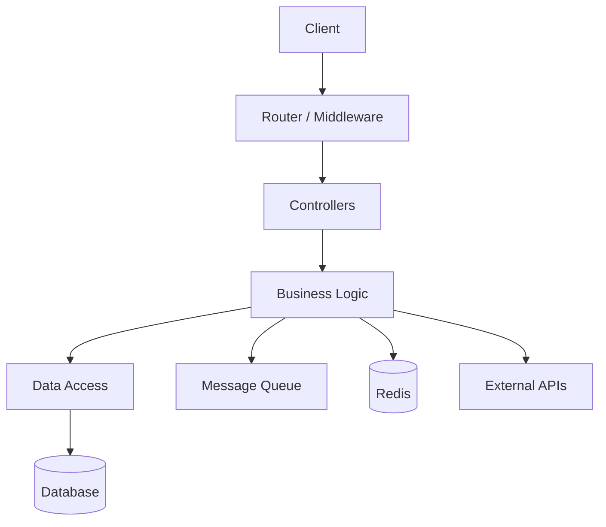
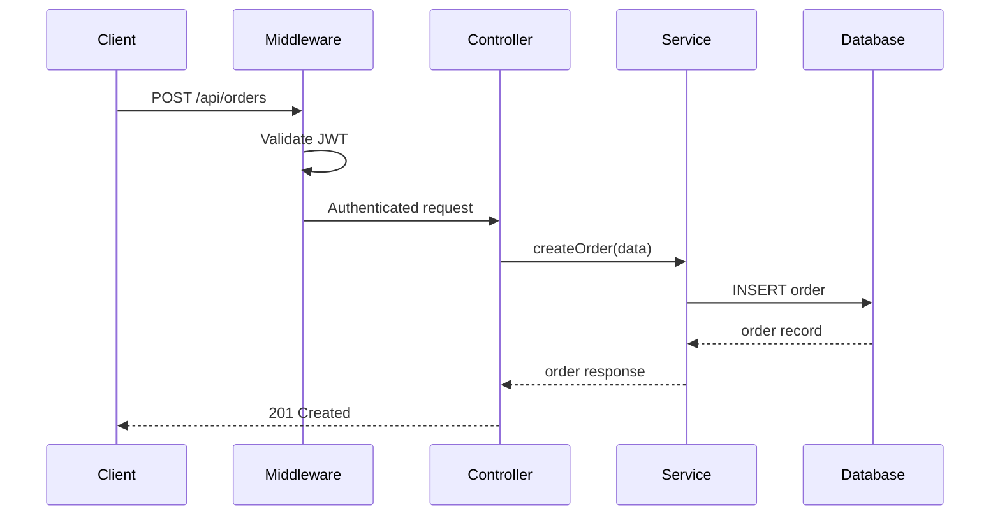

# Backend Checklist

When the repo is classified as a **backend** service, extract the following by reading
actual source files.

---

## Routes & API Endpoints

Identify every API endpoint using framework-specific patterns:

- **Express.js:** `app.get(`, `app.post(`, `router.get(`, `router.post(`, etc.
- **Fastify:** `fastify.get(`, `fastify.route(`.
- **NestJS:** `@Get(`, `@Post(`, `@Controller(` decorators.
- **Django:** `urlpatterns`, `path(`, DRF `@action`.
- **Flask:** `@app.route(`, `@blueprint.route(`.
- **FastAPI:** `@app.get(`, `@router.post(`.
- **Rails:** `config/routes.rb`.
- **Go:** `HandleFunc`, `r.GET`, `e.POST`.
- **Rust:** `#[get(`, `.route(`.
- **GraphQL:** schema queries and mutations.
- **OpenAPI/Swagger:** parse `openapi.yaml` or `swagger.json` if present.

For each: method, path, purpose, request params, response shape, auth required, rate limited.

## Architecture

Determine the pattern: monolith, microservices, serverless, modular monolith.

Look for: directory structure (`controllers/`, `services/`, `repositories/`), layered
architecture, event-driven patterns, CQRS, background job processing.

### Diagram: Architecture layers



### Diagram: Request flow



## Databases & Data Model

```bash
find . -name "*.prisma" -o -name "*.sql" -o -path "*/migrations/*" -o -path "*/models/*" | head -30
grep -rn 'DATABASE_URL\|MONGO_URI\|REDIS_URL\|postgres\|mysql\|sqlite\|mongodb\|dynamodb' \
  --include="*.ts" --include="*.js" --include="*.py" --include="*.rb" --include="*.go" \
  --include="*.env*" --include="*.yaml" --include="*.yml" --include="*.toml" .
```

For each data store: type, what data it holds, key tables, relationships, migration tool.

### Diagram: ER diagram

```mermaid
erDiagram
    USER ||--o{ ORDER : places
    USER { uuid id PK; string email; string name; string role }
    ORDER ||--|{ ORDER_ITEM : contains
    ORDER { uuid id PK; uuid user_id FK; decimal total; string status }
```

## Dependencies & External Services

Categorize: web framework, DB/ORM, auth, message queue, external APIs, caching,
file storage, monitoring, testing.

Flag external services — each is a failure point the PM should know about.

## Authentication & Authorization

Document: auth method, where enforced, role/permission model, public vs protected
endpoints, token lifecycle.

### Diagram: Auth flow

Generate a sequence diagram showing login, token refresh, logout.

## Error Handling

```bash
grep -rn 'catch\|except\|Error\|error_handler\|middleware.*error\|retry\|circuit.break' \
  src/ app/ --include="*.ts" --include="*.js" --include="*.py" --include="*.rb" --include="*.go"
```

Check: global error handler, structured logging, generic vs leaky errors, retries,
health check endpoint.

## Environment & Configuration

```bash
find . -name ".env*" -o -name "config.*" -o -name "settings.*" | head -20
grep -rn 'process\.env\.\|os\.environ\|os\.getenv\|ENV\[' \
  --include="*.ts" --include="*.js" --include="*.py" --include="*.rb" . | \
  grep -oP '(process\.env\.\w+|os\.environ\.get\("\w+"|os\.getenv\("\w+")' | sort -u
```

## Testing

```bash
find . -name "*test*" -o -name "*spec*" -o -name "__tests__" | head -30
```

Are critical paths tested? Integration tests present?

## API Documentation

```bash
find . -name "openapi*" -o -name "swagger*" -o -path "*/docs/*" | head -10
```

If present, note format and freshness. If absent, flag as gap.

## Activity Signals

```bash
git -C [repo-path] log -1 --format="%ci" 2>/dev/null
git -C [repo-path] log --oneline -50 --name-only --pretty=format: 2>/dev/null | \
  grep -v '^$' | sed 's|/[^/]*$||' | sort | uniq -c | sort -rn | head -10
git -C [repo-path] shortlog -sn --all 2>/dev/null | wc -l
```
