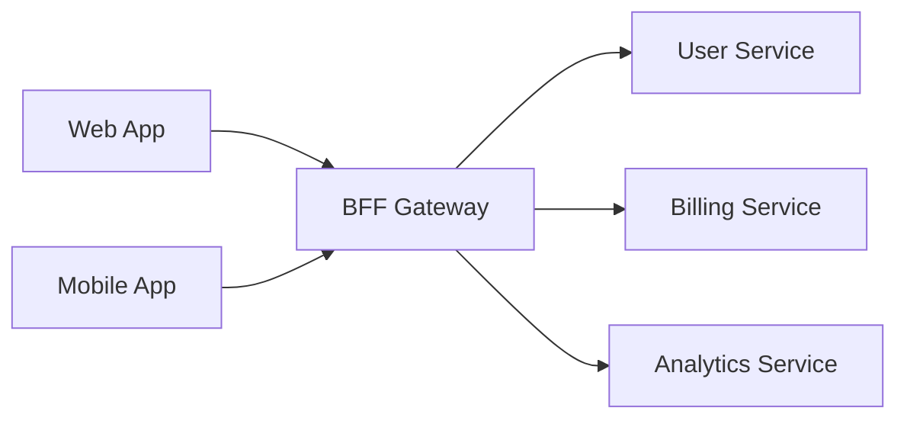
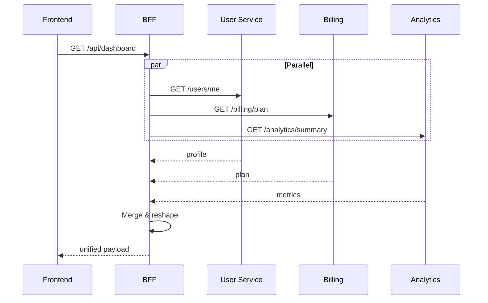

# BFF (Backend-for-Frontend) Checklist

A BFF is a thin backend that sits between frontends and backend services. It aggregates,
reshapes, and caches data for a specific frontend's needs.

---

## Confirming BFF Classification

Likely a BFF if:
- Makes outbound HTTP/gRPC calls to other internal services
- Has few or no database tables of its own
- Routes correspond to what a specific frontend needs
- Aggregates multiple service responses into one
- Exists to shield the frontend from backend complexity

If it owns substantial business logic or a primary database → reclassify as **backend**.

## API Surface

Map every endpoint. Additionally note: which frontend consumes it, which downstream
services it calls, what data transformation it performs.

| BFF Endpoint | Frontend | Downstream Services | Transformation |
|---|---|---|---|
| `GET /api/dashboard` | Web app | User Svc, Billing Svc, Analytics Svc | Merges profile + plan + usage |

### Diagram: BFF Orchestration



### Diagram: Request aggregation

For the most complex endpoint, show the aggregation sequence:



## Downstream Service Dependencies

```bash
grep -rn 'fetch(\|axios\.\|http\.\|got(\|request(\|httpx\|reqwest\|HttpClient' src/ app/
grep -rn 'grpc\|protobuf\|\.proto' src/ app/
grep -rn 'SERVICE_URL\|API_URL\|BASE_URL\|ENDPOINT\|_HOST\|_PORT' \
  --include="*.env*" --include="*.yaml" --include="*.ts" --include="*.py" .
```

For each: name, purpose, communication method, config variable, failure behavior.

## Data Aggregation Patterns

Identify per endpoint: sequential, parallel, cached, or streamed.
Sequential = slower + fragile. This affects page load — product-relevant.

## Caching Layer

```bash
grep -rn 'cache\|Cache\|redis\|ttl\|expires\|stale\|revalidate\|memoize' src/ app/
```

For each cache: what's cached, TTL, invalidation strategy, staleness risk.

**PM relevance:** 5-min TTL on billing = user sees old plan for up to 5 min after upgrade.

## Auth & Session Management

- Proxies auth tokens to downstream?
- Manages its own session?
- Enriches requests with user context?
- Handles token refresh for frontend?

## Error Handling & Resilience

```bash
grep -rn 'circuit.break\|retry\|timeout\|fallback\|catch\|degrade\|partial' src/ app/
```

Check: circuit breakers, timeouts, partial responses, retry logic.

**PM key question:** "If recommendations service is down, does the homepage fail
completely or just show without recommendations?"

## PM Summary Questions

Answer each in the report:

1. **Dependent frontends:** if this goes down, what breaks?
2. **Abstracted services:** the dependency chain for any frontend feature
3. **Latency profile:** endpoints aggregating 5+ services that may be slow
4. **Failure blast radius:** per downstream failure, what degrades?
5. **Redundancy:** can the frontend work without the BFF?
6. **Hidden business rules:** pricing logic, eligibility checks, feature flags
   buried in the BFF without documentation

## Activity Signals

```bash
git -C [repo-path] log -1 --format="%ci" 2>/dev/null
git -C [repo-path] log --oneline -50 --name-only --pretty=format: 2>/dev/null | \
  grep -v '^$' | sed 's|/[^/]*$||' | sort | uniq -c | sort -rn | head -10
```
