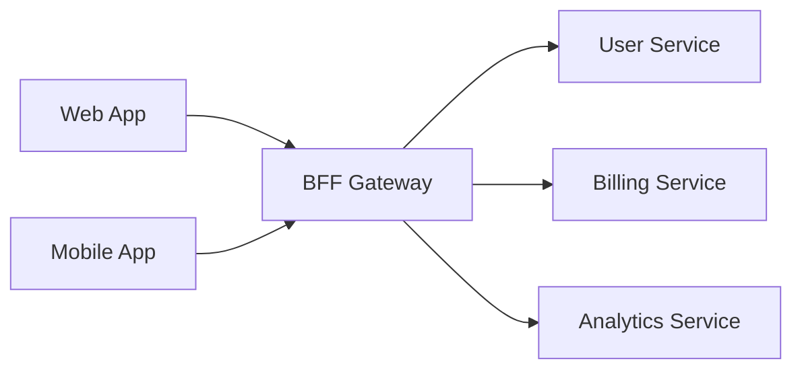
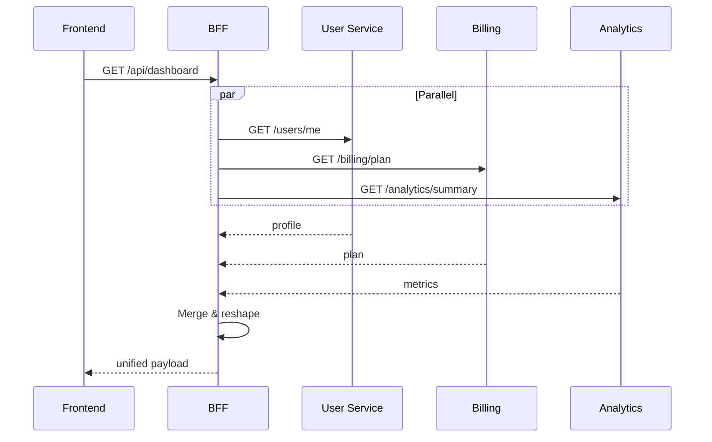

# BFF (Backend-for-Frontend) Checklist

A BFF is a thin backend that sits between frontends and backend services. It aggregates,
reshapes, and caches data for a specific frontend's needs.

Prefer `rg`/`rg --files` and scan the real service roots in the repo rather than
assuming `src/` or `app/` exists.

---

## Confirming BFF Classification

Likely a BFF if:
- Makes outbound HTTP/gRPC calls to other internal services
- Has few or no database tables of its own
- Routes correspond to what a specific frontend needs
- Aggregates multiple service responses into one
- Exists to shield the frontend from backend complexity

If it owns substantial business logic or a primary database → reclassify as **backend**.

## API Surface

Map every endpoint. Additionally note: which frontend consumes it, which downstream
services it calls, what data transformation it performs, and the **source file and
line number** that defines it.

Include code snippets for endpoints with complex aggregation logic:

````markdown
::: details 📄 Source: `src/routes/dashboard.ts:20-45`
```typescript
router.get('/api/dashboard', authenticate, async (req, res) => {
  const [profile, billing, usage] = await Promise.all([
    userService.getProfile(req.user.id),
    billingService.getPlan(req.user.id),
    analyticsService.getUsageSummary(req.user.id),
  ])
  res.json({ profile, plan: billing.plan, usage: usage.summary })
})
```
:::
````

| BFF Endpoint | Frontend | Downstream Services | Transformation |
|---|---|---|---|
| `GET /api/dashboard` | Web app | User Svc, Billing Svc, Analytics Svc | Merges profile + plan + usage |

### Diagram: BFF Orchestration



### Diagram: Request aggregation

For the most complex endpoint, show the aggregation sequence:



## Downstream Service Dependencies

```bash
rg -n 'fetch\(|axios\.|http\.|got\(|request\(|httpx|reqwest|HttpClient' .
rg -n 'grpc|protobuf|\.proto' .
rg -n 'SERVICE_URL|API_URL|BASE_URL|ENDPOINT|_HOST|_PORT' .
```

For each: name, purpose, communication method, config variable, failure behavior.

If the consuming frontend is not explicit, infer it from route names, typed client imports,
workspace names, or environment variable naming and label that inference clearly.

## Data Aggregation Patterns

Identify per endpoint: sequential, parallel, cached, or streamed.
Sequential = slower + fragile. This affects page load — product-relevant.

## Caching Layer

```bash
rg -n 'cache|Cache|redis|ttl|expires|stale|revalidate|memoize' .
```

For each cache: what's cached, TTL, invalidation strategy, staleness risk.

**PM relevance:** 5-min TTL on billing = user sees old plan for up to 5 min after upgrade.

## Analytics & Tracking Events

BFF layers often proxy or enrich analytics events between frontend and backend.

```bash
rg -n 'track\(|analytics\.|logEvent|emit\(|publish\(' .
rg -n 'x-request-id|correlation.id|trace' .
```

For each: event name, trigger, payload, whether it originates in the BFF or is
proxied from the frontend, **source file, and line number**.

| Event Name | Trigger | Origin | Destination | Source File | Line |
|------------|---------|--------|-------------|-------------|------|
| `api_call_duration` | Every request | BFF | Datadog | `src/middleware/metrics.ts` | 12 |
| `aggregation_error` | Downstream failure | BFF | Sentry | `src/utils/resilience.ts` | 55 |

## Auth & Session Management

- Proxies auth tokens to downstream?
- Manages its own session?
- Enriches requests with user context?
- Handles token refresh for frontend?

## Error Handling & Resilience

```bash
rg -n 'circuit\\.break|retry|timeout|fallback|catch|degrade|partial' .
```

Check: circuit breakers, timeouts, partial responses, retry logic.

**PM key question:** "If recommendations service is down, does the homepage fail
completely or just show without recommendations?"

## PM Summary Questions

Answer each in the report:

1. **Dependent frontends:** if this goes down, what breaks?
2. **Abstracted services:** the dependency chain for any frontend feature
3. **Latency profile:** endpoints aggregating 5+ services that may be slow
4. **Failure blast radius:** per downstream failure, what degrades?
5. **Redundancy:** can the frontend work without the BFF?
6. **Hidden business rules:** pricing logic, eligibility checks, feature flags
   buried in the BFF without documentation

## Activity Signals

```bash
git -C [repo-path] log -1 --format="%ci" 2>/dev/null
git -C [repo-path] log --oneline -50 --name-only --pretty=format: 2>/dev/null | \
  grep -v '^$' | sed 's|/[^/]*$||' | sort | uniq -c | sort -rn | head -10
```
