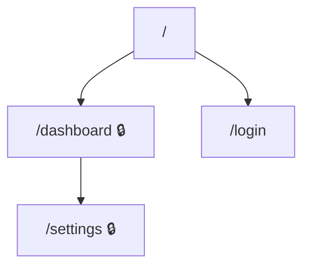
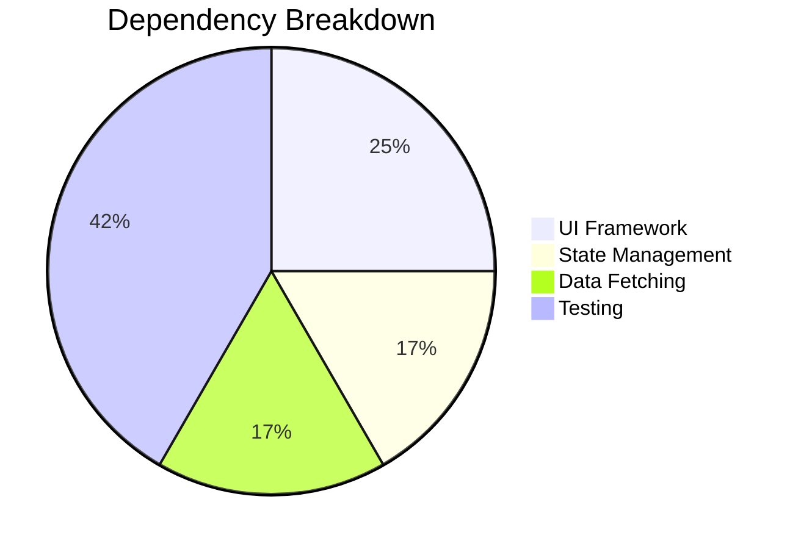

# Frontend Checklist

When the repo is classified as a **frontend** application, extract the following
by reading actual source files. Do not guess — use `grep`, `find`, and file reads.

---

## Routes & Pages

Identify every route the user can navigate to.

- **Next.js (App Router):** scan `app/` for `page.tsx`, `page.jsx`, `page.js`.
- **Next.js (Pages Router):** scan `pages/` for `.tsx`, `.jsx`, `.js`.
- **React Router:** search for `<Route`, `createBrowserRouter`, `createRoutesFromElements`.
- **Vue Router:** search for `router/index.ts` or `router.js`, look for `routes` array.
- **Angular:** search for `*-routing.module.ts` or `app.routes.ts`.
- **SvelteKit:** scan `src/routes/` for `+page.svelte`.
- **Astro:** scan `src/pages/`.

For each route record: URL path, auth required, component, dynamic segments.

### Diagram: Route map

Generate a Mermaid flowchart of the page hierarchy. Mark auth-required routes differently:



## User Inputs

```bash
grep -rn '<form\|<input\|<textarea\|<select\|type="file"\|onChange\|onSubmit\|handleSubmit\|useForm\|Formik\|react-hook-form\|zod\|yup' src/
grep -rn 'useSearchParams\|useParams\|router.query\|URLSearchParams' src/
grep -rn 'upload\|dropzone\|FileReader\|formData\|multipart' src/
```

For each: page/route, field names + types, validation rules, destination, error handling.

## Analytics & Tracking Events

```bash
grep -rn 'track(\|analytics\.\|gtag(\|ga(\|posthog\.\|mixpanel\.\|amplitude\.\|segment\.\|plausible\.\|umami\.\|logEvent\|trackEvent\|sendEvent\|dataLayer\.push' src/
grep -rn 'pageview\|page_view\|trackPageView' src/
grep -rn 'Sentry\.\|captureException\|captureMessage\|LogRocket\|Bugsnag' src/
```

For each: event name, trigger, payload, provider.

## Analytics Gaps

Check if these PM questions can be answered from existing analytics:

- **Acquisition:** How do users arrive? (referrer, UTM)
- **Activation:** Do users complete onboarding?
- **Engagement:** Which features used most / least?
- **Conversion:** Form completions tracked? Drop-off points in multi-step flows?
- **Errors:** Client-side errors tracked?
- **Performance:** Core Web Vitals or page load tracked?
- **Search:** If search exists, are queries + result counts logged?

Frame each gap as: "You cannot answer: [question]. Add event [X] on [trigger]."

## Dependencies

From `package.json`, categorize into: UI framework, state management, styling,
data fetching, form handling, analytics, error tracking, testing, build tooling.

Flag deprecated, duplicated, or security-concern items.

### Diagram: Dependency pie chart



## Accessibility

```bash
grep -rn 'aria-\|role=\|alt=\|tabIndex\|sr-only\|visually-hidden\|a11y' src/
```

## Error Handling & Loading States

```bash
grep -rn 'ErrorBoundary\|Suspense\|fallback\|skeleton\|spinner\|loading' src/
```

Note routes/features lacking error or loading states.

## Activity Signals

```bash
git -C [repo-path] log -1 --format="%ci" 2>/dev/null
git -C [repo-path] log --oneline -50 --name-only --pretty=format: 2>/dev/null | \
  grep -v '^$' | sed 's|/[^/]*$||' | sort | uniq -c | sort -rn | head -10
git -C [repo-path] shortlog -sn --all 2>/dev/null | wc -l
```

Report: last updated date, most active directories, contributor count.
