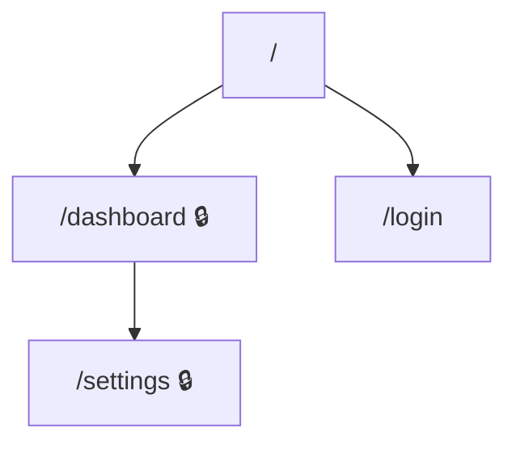
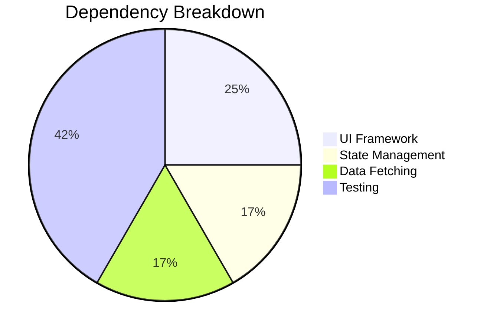

# Frontend Checklist

When the repo is classified as a **frontend** application, extract the following
by reading actual source files. Do not guess.

Prefer `rg`/`rg --files` and scan the actual app roots the repo uses (`src/`, `app/`,
`pages/`, `components/`, `routes/`, `packages/*`, etc.) rather than assuming `src/`
exists.

---

## Routes & Pages

Identify every route the user can navigate to.

- **Next.js (App Router):** scan `app/` for `page.tsx`, `page.jsx`, `page.js`.
- **Next.js (Pages Router):** scan `pages/` for `.tsx`, `.jsx`, `.js`.
- **React Router:** search for `<Route`, `createBrowserRouter`, `createRoutesFromElements`.
- **Vue Router:** search for `router/index.ts` or `router.js`, look for `routes` array.
- **Angular:** search for `*-routing.module.ts` or `app.routes.ts`.
- **SvelteKit:** scan `src/routes/` for `+page.svelte`.
- **Astro:** scan `src/pages/`.

For each route record: URL path, auth required, component, dynamic segments, and the
source file that defines it (include file path and line number).

Example code reference for a route definition:

````markdown
::: details 📄 Source: `app/dashboard/page.tsx:1-12`
```tsx
export default function DashboardPage() {
  // Auth enforced by middleware — see auth.md
  return <DashboardLayout>...</DashboardLayout>
}
```
:::
````

### Diagram: Route map

Generate a Mermaid flowchart of the page hierarchy. Mark auth-required routes differently:



## User Inputs

```bash
rg -n '<form|<input|<textarea|<select|type="file"|onChange|onSubmit|handleSubmit|useForm|Formik|react-hook-form|zod|yup' .
rg -n 'useSearchParams|useParams|router\.query|URLSearchParams' .
rg -n 'upload|dropzone|FileReader|formData|multipart' .
```

For each: page/route, field names + types, validation rules, destination, error handling.

## Analytics & Tracking Events

```bash
rg -n 'track\(|analytics\.|gtag\(|ga\(|posthog\.|mixpanel\.|amplitude\.|segment\.|plausible\.|umami\.|logEvent|trackEvent|sendEvent|dataLayer\.push' .
rg -n 'pageview|page_view|trackPageView' .
rg -n 'Sentry\.|captureException|captureMessage|LogRocket|Bugsnag' .
```

For each: event name, trigger, payload, provider, **source file, and line number**.

Build the analytics inventory table as you scan:

| Event Name | Trigger | Payload Fields | Provider | Source File | Line |
|------------|---------|----------------|----------|-------------|------|
| `page_view` | Route change | `{ path, title }` | GA4 | `src/analytics.ts` | 15 |
| `button_click` | CTA click | `{ button_id, page }` | Mixpanel | `src/components/Hero.tsx` | 42 |

For events with complex payloads or conditional logic, include a code snippet:

````markdown
::: details 📄 Source: `src/analytics/track.ts:30-45`
```typescript
export function trackPurchase(order: Order) {
  analytics.track('purchase_completed', {
    order_id: order.id,
    total: order.total,
    items: order.items.length,
    coupon: order.coupon ?? 'none',
  })
}
```
:::
````

## Analytics Gaps

Check if these PM questions can be answered from existing analytics:

- **Acquisition:** How do users arrive? (referrer, UTM)
- **Activation:** Do users complete onboarding?
- **Engagement:** Which features used most / least?
- **Conversion:** Form completions tracked? Drop-off points in multi-step flows?
- **Errors:** Client-side errors tracked?
- **Performance:** Core Web Vitals or page load tracked?
- **Search:** If search exists, are queries + result counts logged?

Frame each gap as: "You cannot answer: [question]. Add event [X] on [trigger]."

## Dependencies

From `package.json`, categorize into: UI framework, state management, styling,
data fetching, form handling, analytics, error tracking, testing, build tooling.

Flag deprecated, duplicated, or security-concern items.

If the app is SSR/SSG/ISR capable (Next.js, Nuxt, Astro, Remix, etc.), note which
rendering modes are used because that changes caching, SEO, and release behavior.

### Diagram: Dependency pie chart



## Accessibility

```bash
rg -n 'aria-|role=|alt=|tabIndex|sr-only|visually-hidden|a11y' .
```

## Error Handling & Loading States

```bash
rg -n 'ErrorBoundary|Suspense|fallback|skeleton|spinner|loading' .
```

Note routes/features lacking error or loading states.

## Activity Signals

```bash
git -C [repo-path] log -1 --format="%ci" 2>/dev/null
git -C [repo-path] log --oneline -50 --name-only --pretty=format: 2>/dev/null | \
  grep -v '^$' | sed 's|/[^/]*$||' | sort | uniq -c | sort -rn | head -10
git -C [repo-path] shortlog -sn --all 2>/dev/null | wc -l
```

Report: last updated date, most active directories, contributor count.
